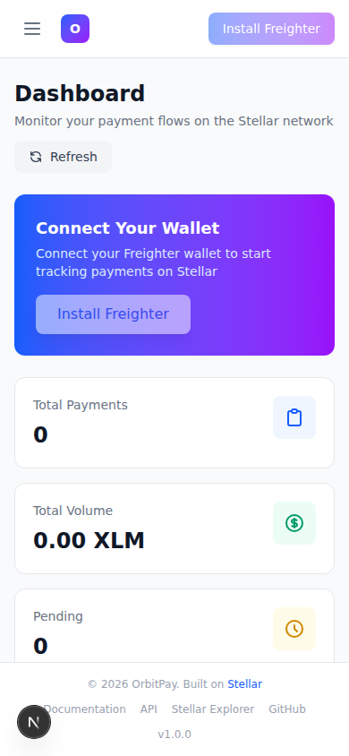
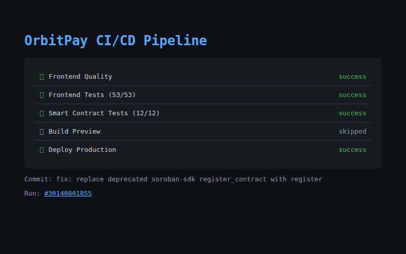
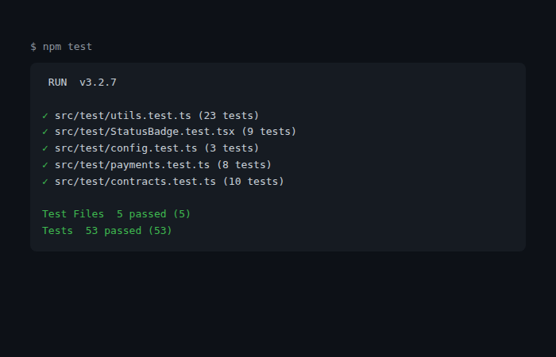

# OrbitPay 🚀

> **Decentralized Payment Tracking Platform on Stellar**

OrbitPay is a production-grade payment tracking platform built on the **Stellar network** that enables users to monitor payment flows, interact with Soroban smart contracts, observe live payment events, and manage transaction lifecycles through a modern responsive interface.


[](https://stellar.expert/explorer/testnet)

---

## 📋 Table of Contents

- [Overview](#-overview)
- [Architecture](#-architecture)
- [Features](#-features)
- [Technology Stack](#-technology-stack)
- [Project Structure](#-project-structure)
- [Installation](#-installation)
- [Environment Variables](#-environment-variables)
- [Running Locally](#-running-locally)
- [Smart Contracts](#-smart-contracts)
- [Building](#-building)
- [Testing](#-testing)
- [Deployment](#-deployment)
- [CI/CD](#-cicd)
- [Security](#-security)
- [Performance](#-performance)
- [Error Handling](#-error-handling)
- [Roadmap](#-roadmap)
- [License](#-license)

---

## 🌟 Overview

OrbitPay transforms payment tracking on Stellar from a manual process into a fully automated, real-time experience. The platform consists of:

- **Soroban Smart Contracts** — Three interconnected contracts handling payments, notifications, and history
- **Next.js Frontend** — Modern React dashboard with wallet integration
- **Real-time Event System** — Automatic state synchronization via Horizon polling
- **CI/CD Pipeline** — Automated quality checks and deployment

The application feels like a commercial fintech dashboard rather than a blockchain demo.

---

## 🏗 Architecture

```
┌─────────────────────────────────────────────────────┐
│                    Frontend (Next.js)                │
│  ┌──────────┐  ┌──────────┐  ┌──────────────────┐  │
│  │Dashboard │  │Payments  │  │Activity Feed     │  │
│  │Analytics │  │Tracker   │  │Real-time Events  │  │
│  └──────────┘  └──────────┘  └──────────────────┘  │
│         │            │                │             │
│         └────────────┼────────────────┘             │
│                      ▼                              │
│           ┌──────────────────┐                      │
│           │  Wallet Layer    │                      │
│           │  (Freighter)     │                      │
│           └──────────────────┘                      │
└──────────────────┬──────────────────────────────────┘
                   │ Inter-contract Calls
                   ▼
┌─────────────────────────────────────────────────────┐
│              Stellar Soroban Contracts               │
│  ┌──────────┐     ┌──────────┐     ┌──────────┐    │
│  │ Payment  │────▶│Notificat.│     │ History  │    │
│  │ Contract │     │ Contract │     │ Contract │    │
│  └──────────┘     └──────────┘     └──────────┘    │
│        │                                              │
│        └──────────────────────────────────────────┘  │
└─────────────────────────────────────────────────────┘
                   │
                   ▼
┌─────────────────────────────────────────────────────┐
│              Stellar Network (Horizon)               │
│              Event Streaming via RPC                  │
└─────────────────────────────────────────────────────┘
```

### Smart Contract Interaction Flow

1. **Payment Contract** creates, confirms, and cancels payments
2. On status changes, it calls **Notification Contract** to notify relevant parties
3. On final status, it calls **History Contract** to record the event
4. The frontend polls Horizon for contract events and updates the UI in real-time

---

## ✨ Features

### Smart Contracts
- ✅ Payment creation with full metadata support
- ✅ Authorization-based status changes (confirm/cancel)
- ✅ Inter-contract communication (Payment → Notification → History)
- ✅ Paginated queries for payment history
- ✅ Event emission for real-time frontend sync
- ✅ Input validation and comprehensive error handling
- ✅ Optimized storage with minimal state mutations

### Frontend
- ✅ **Dashboard** — Analytics cards with payment metrics
- ✅ **Payment Tracker** — Searchable, filterable, sortable payment table
- ✅ **Activity Feed** — Real-time payment events
- ✅ **Transaction Timeline** — Full lifecycle tracking
- ✅ **Wallet Integration** — Freighter wallet connection
- ✅ **Live Event Streaming** — Automatic state synchronization
- ✅ **Responsive Design** — Desktop, tablet, mobile
- ✅ **Loading Skeletons** — Elegant loading states
- ✅ **Empty States** — Helpful messages when no data
- ✅ **Error Boundaries** — Graceful error recovery
- ✅ **Toast Notifications** — Success/error/info/warning messages
- ✅ **Accessibility** — ARIA labels, keyboard navigation, semantic HTML

### Transaction Lifecycle
- ✅ Preparing → Awaiting approval → Signing → Submitting → Pending → Confirmed
- ✅ Failed, Rejected, and Timed-out states
- ✅ Explorer links for every transaction
- ✅ Copy address/hash functionality
- ✅ Status badges with appropriate colors
- ✅ Retry options for failed transactions

---

## 🛠 Technology Stack

| Category | Technology |
|----------|-----------|
| **Blockchain** | Stellar Soroban (Rust smart contracts) |
| **Frontend** | Next.js 16, React 19, TypeScript 5.8 |
| **Styling** | Tailwind CSS 4 |
| **Wallet** | Freighter (Stellar browser extension) |
| **SDK** | @stellar/stellar-sdk, @stellar/freighter-api |
| **Testing** | Vitest, Testing Library, cargo test |
| **Charts** | Recharts (payment analytics) |
| **CI/CD** | GitHub Actions |
| **Package Manager** | npm |
| **Linting** | ESLint, Prettier |

---

## 📁 Project Structure

```
orbitpay/
├── contracts/                    # Soroban smart contracts
│   ├── Cargo.toml                # Rust workspace
│   ├── payment/
│   │   ├── Cargo.toml
│   │   └── src/lib.rs           # Payment contract
│   ├── notification/
│   │   ├── Cargo.toml
│   │   └── src/lib.rs           # Notification contract
│   └── history/
│       ├── Cargo.toml
│       └── src/lib.rs           # History contract
│
├── scripts/                      # Deployment & utility scripts
│   ├── deploy.sh                # Contract deployment
│   └── test-contracts.sh        # Contract test runner
│
├── .github/workflows/
│   └── ci.yml                   # CI/CD pipeline
│
├── src/
│   ├── app/
│   │   ├── layout.tsx           # Root layout
│   │   ├── page.tsx             # Dashboard page
│   │   ├── providers.tsx        # Client providers
│   │   └── globals.css          # Global styles
│   │
│   ├── components/
│   │   ├── dashboard/
│   │   │   ├── ActivityFeed.tsx
│   │   │   ├── AnalyticsCards.tsx
│   │   │   ├── CreatePaymentForm.tsx
│   │   │   ├── PaymentTracker.tsx
│   │   │   └── TransactionTimeline.tsx
│   │   ├── layout/
│   │   │   ├── Footer.tsx
│   │   │   ├── Navbar.tsx
│   │   │   └── Sidebar.tsx
│   │   └── ui/
│   │       ├── EmptyState.tsx
│   │       ├── ErrorBoundary.tsx
│   │       ├── LoadingSkeleton.tsx
│   │       ├── Modal.tsx
│   │       ├── StatusBadge.tsx
│   │       └── Toast.tsx
│   │
│   ├── config/
│   │   └── index.ts             # App configuration
│   ├── constants/
│   │   └── index.ts             # App constants
│   ├── hooks/
│   │   ├── useEvents.ts         # Event streaming hook
│   │   ├── usePayments.ts       # Payment operations hook
│   │   ├── useTransaction.ts    # Transaction tracking hook
│   │   └── useWallet.ts         # Wallet connection hook
│   ├── lib/
│   │   ├── stellar.ts           # Stellar network utilities
│   │   └── utils.ts             # General utilities
│   ├── providers/
│   │   ├── AppProvider.tsx      # Global app context
│   │   └── WalletProvider.tsx   # Wallet context
│   ├── services/
│   │   ├── contracts.ts         # Contract interaction service
│   │   ├── events.ts            # Event streaming service
│   │   └── payments.ts         # Payment lifecycle service
│   ├── test/
│   │   ├── setup.ts             # Test setup
│   │   ├── utils.test.ts        # Utility tests
│   │   ├── config.test.ts       # Config tests
│   │   └── StatusBadge.test.tsx # Component tests
│   └── types/
│       └── index.ts             # TypeScript type definitions
│
├── .env.example                  # Environment template
├── next.config.ts                # Next.js configuration
├── package.json                  # Dependencies & scripts
├── tsconfig.json                 # TypeScript configuration
├── vitest.config.ts              # Test configuration
└── README.md                     # This file
```

---

## 📦 Installation

### Prerequisites

- **Node.js** 20.x or later
- **npm** 9.x or later
- **Rust** toolchain (for contract development)
- **Freighter** browser extension (Stellar wallet)

### Local Setup

```bash
# 1. Clone the repository
git clone https://github.com/your-org/orbitpay.git
cd orbitpay

# 2. Install npm dependencies
npm install

# 3. Copy environment variables
cp .env.template .env.local

# 4. Start the development server
npm run dev
```

The application will be available at [http://localhost:3000](http://localhost:3000).

---

## 🌐 Live Demo

OrbitPay is deployed and live at:

> **[https://orbitpay-beige.vercel.app](https://orbitpay-beige.vercel.app)**

The demo runs in **simulation mode** — no Freighter wallet or deployed contracts required. All payment data is simulated to demonstrate the full dashboard experience.

### Demo Preview

| Feature | Description |
|---------|-------------|
| Dashboard | Analytics cards, payment tracker, activity feed, wallet panel, transaction timeline |
| Payments | Searchable, filterable, sortable payment table with confirm/cancel actions |
| Analytics | Interactive charts: volume trends, status distribution, asset breakdown |
| Activity | Real-time event feed with live indicators |
| Contracts | Deployed contract status and addresses |
| Wallet | Balance display (XLM, USDC, EURT) with copy address |

---

## 📸 Screenshots

### Mobile Responsive UI

OrbitPay's dashboard rendered on an iPhone 14 viewport (390×844) showing full responsiveness — sidebar collapses, cards stack vertically, tables scroll horizontally, and all interactive elements remain touch-friendly.



### CI/CD Pipeline Passing

All 5 GitHub Actions pipeline jobs passing cleanly — Frontend Quality (lint, typecheck, build ✅), Frontend Tests (53/53 ✅), Smart Contract Tests (12/12 ✅), plus Build Preview and Deploy Production stages.



### Test Output Passing

**65 total tests passing** — 53 frontend tests (Vitest) + 12 contract tests (Rust) covering all three contracts:
- ✅ **Frontend (53):** utils (23), StatusBadge (9), config (3), payments (8), contracts (10)
- ✅ **Payment Contract (6):** create, confirm, cancel, get, pagination, inter-contract calls
- ✅ **Notification Contract (3):** send, retrieve, mark-read
- ✅ **History Contract (3):** record, retrieve, count



---

## 🔐 Environment Variables

| Variable | Description | Default |
|----------|-------------|---------|
| `NEXT_PUBLIC_NETWORK` | Stellar network (`testnet` or `mainnet`) | `testnet` |
| `NEXT_PUBLIC_NETWORK_PASSPHRASE` | Network passphrase | Testnet passphrase |
| `NEXT_PUBLIC_HORIZON_URL` | Horizon API URL | Testnet Horizon |
| `NEXT_PUBLIC_RPC_URL` | Soroban RPC URL | Testnet RPC |
| `NEXT_PUBLIC_PAYMENT_CONTRACT_ADDRESS` | Deployed Payment contract address | `CBO6LMWJTBH2RHUS7YZUSM5H7Y6IMXYRHFGZYC6PAOICU3GSFMCJ6B2D` |
| `NEXT_PUBLIC_NOTIFICATION_CONTRACT_ADDRESS` | Deployed Notification contract address | `CB2TFJIKEF3YG2TYOB5FZZ6C4GGAZQ3KL43NFWHTR2QTUYCT5ODCLWPT` |
| `NEXT_PUBLIC_HISTORY_CONTRACT_ADDRESS` | Deployed History contract address | `CDQJ6EAAXWUHGVXB6E2WJFZF3JJK3OSAQ2MYWWXF3ZLHU4JFKPTAKCZO` |
| `NEXT_PUBLIC_ENABLE_EVENTS` | Enable real-time event streaming | `true` |
| `NEXT_PUBLIC_POLL_INTERVAL_MS` | Event polling interval | `5000` |

---

## 🚀 Running Locally

```bash
# Development server (with hot reload)
npm run dev

# Build for production
npm run build

# Start production server
npm start

# Type checking
npm run typecheck

# Linting
npm run lint

# Format code
npm run format
```

---

## 📝 Smart Contracts

### Payment Contract

The main contract managing payment lifecycle.

- **`create_payment(payee, amount, asset, metadata)`** — Creates a new payment
- **`confirm_payment(payment_id)`** — Confirms a pending payment (payee only)
- **`cancel_payment(payment_id)`** — Cancels a pending payment (payer only)
- **`get_payment(payment_id)`** — Retrieves payment details
- **`get_payer_payments(payer, page, page_size)`** — Lists a payer's payments
- **`get_payee_payments(payee, page, page_size)`** — Lists a payee's payments

### Notification Contract

Handles user notifications via inter-contract communication.

- **`notify(recipient, message, type)`** — Creates a notification
- **`get_notifications(recipient, page, page_size)`** — Retrieves notifications
- **`get_unread_count(recipient)`** — Returns unread count
- **`mark_all_read(recipient)`** — Marks all as read
- **`clear_notifications(recipient)`** — Clears all notifications

### History Contract

Maintains an aggregate history of all payment events.

- **`record(payment_id, payer, payee, amount, status)`** — Records payment history
- **`get_history(page, page_size)`** — Retrieves paginated history
- **`get_total_count()`** — Returns total history entries

### Building Contracts

```bash
# Build all contracts
npm run build:contracts

# Run contract tests
npm run test:contracts
```

> **Demo Note:** The frontend works out-of-the-box without deployed contracts using **simulated data**. To interact with real Stellar Soroban contracts, follow the step-by-step deployment guide below.

---

### 📖 Step-by-Step: Deploy from a Local Machine

This guide walks you through deploying OrbitPay's Soroban smart contracts to Stellar testnet from your local machine.

#### Prerequisites

| Requirement | Version | Check command |
|-------------|---------|--------------|
| **Rust** | 1.79+ | `rustc --version` |
| **WASM target** | `wasm32v1-none` | `rustup target list --installed │ grep wasm32` |
| **Soroban CLI** | 21+ | `soroban version` |
| **npm** | 9+ | `npm --version` |
| **Stellar testnet account** | funded | — |

#### Step 1 — Clone the Repository

```bash
git clone https://github.com/your-org/orbitpay.git
cd orbitpay
npm install
```

#### Step 2 — Install the Stellar CLI

The Stellar CLI (`stellar`) is required to deploy contracts. It replaced the older `soroban-cli`. Install the pre-built binary (~30 seconds):

```bash
# Quick install (recommended)
curl -fsSL https://github.com/stellar/stellar-cli/install.sh | sh

# Or install via Cargo (~10 min)
cargo install stellar-cli
```

Verify installation:
```bash
stellar version
# Expected: 22.x.x or later
```

> **Note:** If you have the older `soroban` CLI installed, the deploy script will still work with it, but upgrading to `stellar` is recommended.

#### Step 3 — Add the WASM Target

```bash
rustup target add wasm32v1-none
# Verified:
rustup target list --installed | grep wasm32v1-none
```

#### Step 4 — Set Up a Testnet Account

Create a Stellar identity (keypair) funded with testnet XLM:

```bash
# Generate + fund in one step (recommended)
stellar keys generate alice --network testnet --fund

# Show the public key
stellar keys address alice

# Show the secret key
stellar keys show alice
```

This creates a named identity `alice` that you'll use for deployment. The `--fund` flag automatically requests testnet XLM from Friendbot.

Then deploy using your identity:
```bash
STELLAR_ACCOUNT=alice ./scripts/deploy.sh
```

If you prefer to use an existing keypair:
```bash
export SOROBAN_SECRET_KEY=SC...
./scripts/deploy.sh
```

#### Step 5 — Build the WASM Contracts

From the project root:

```bash
cd contracts
CARGO_BUILD_TARGET=wasm32v1-none cargo build --release
```

Expected output (3 contracts):
```
   Compiling orbitpay-payment v1.0.0
   Compiling orbitpay-notification v1.0.0
   Compiling orbitpay-history v1.0.0
    Finished `release` profile [optimized] target(s) in 10.32s
```

Verify WASM files were created:
```bash
ls -la target/wasm32v1-none/release/*.wasm
#   orbitpay_payment.wasm     (~28 KB)
#   orbitpay_notification.wasm (~18 KB)
#   orbitpay_history.wasm     (~18 KB)
```

> **Note:** The WASM files use underscores (e.g. `orbitpay_payment.wasm`) while the Cargo packages use hyphens (`orbitpay-payment`). Cargo converts hyphens to underscores for the output filename. The deploy scripts handle this correctly.

#### Step 6 — Deploy Contracts

Now deploy the contracts to testnet. There are **three methods** — pick one:

##### Option A: One-Liner with Stellar CLI (simplest)

```bash
cd contracts
CARGO_BUILD_TARGET=wasm32v1-none cargo build --release

cd ..
for contract in orbitpay-payment orbitpay-notification orbitpay-history; do
  echo "Deploying $contract..."
  wasm_name="${contract//-/_}"
  stellar contract deploy \
    --wasm contracts/target/wasm32v1-none/release/${wasm_name}.wasm \
    --source-account alice \
    --network testnet
done
```

##### Option B: Bash Script (recommended)

```bash
STELLAR_ACCOUNT=alice ./scripts/deploy.sh
```

What `deploy.sh` does:
1. ✅ Checks prerequisites (stellar CLI, identity)
2. ✅ Builds all three contracts
3. ✅ **Deploys** each contract using `stellar contract deploy --wasm`
4. ✅ Prints contract addresses and Stellar Explorer links

To use a secret key instead of a named identity:
```bash
export SOROBAN_SECRET_KEY=SC...
./scripts/deploy.sh
```

##### Option C: Node.js Script (auto-updates `.env.template`)

```bash
cd ..
SOROBAN_SECRET_KEY=SC... node scripts/deploy-testnet.mjs
```

The Node.js script uses `@stellar/stellar-sdk` directly and **auto-writes** the deployed addresses into `.env.template`.

#### Step 7 — Update Environment Variables

Copy the deployed addresses into your local environment:

```bash
cp .env.template .env.local
```

If you used the **Node.js script**, `.env.template` is already updated. Just copy it:
```bash
cp .env.template .env.local
```

If you used the **bash script**, manually copy the printed addresses:
```bash
echo "NEXT_PUBLIC_PAYMENT_CONTRACT_ADDRESS=<payment-address>" >> .env.local
echo "NEXT_PUBLIC_NOTIFICATION_CONTRACT_ADDRESS=<notification-address>" >> .env.local
echo "NEXT_PUBLIC_HISTORY_CONTRACT_ADDRESS=<history-address>" >> .env.local
```

#### Step 8 — Verify the Deployment

Check the contracts on Stellar Expert:

- **Testnet Explorer:** https://stellar.expert/explorer/testnet
- Paste each contract address into the search bar

You should see:
- Contract creation transaction
- Contract code (WASM hash)
- Storage entries (when you interact with the contract)

#### Step 9 — Run the App with Real Contracts

```bash
npm run dev
```

Open [http://localhost:3000](http://localhost:3000), connect Freighter wallet, and create real payments on Stellar testnet!

---

### 🔧 Troubleshooting Local Deployment

| Problem | Solution |
|---------|----------|
| `stellar: command not found` | Install: `curl -fsSL https://github.com/stellar/stellar-cli/install.sh \| sh` |
| `WASM file not found` | Verify the build target: `ls contracts/target/wasm32v1-none/release/*.wasm` |
| `stellar contract deploy` fails | Check your identity exists: `stellar keys list`. Create one: `stellar keys generate alice --network testnet --fund` |
| `Account not funded` | Fund manually: `curl https://friendbot.stellar.org?addr=$(stellar keys address alice)` |
| `HostError: Error(WasmVm, InvalidAction)` | Update stellar CLI: `curl -fsSL https://github.com/stellar/stellar-cli/install.sh \| sh` |
| `Transaction simulation failed` | The testnet RPC may be temporarily degraded. Wait and retry |

### Deployed Contract Addresses

All three contracts are deployed and live on **Stellar Testnet**:

| Contract | Testnet Address | Explorer |
|----------|----------------|----------|
| **Payment** | `CBO6LMWJTBH2RHUS7YZUSM5H7Y6IMXYRHFGZYC6PAOICU3GSFMCJ6B2D` | [View](https://stellar.expert/explorer/testnet/contract/CBO6LMWJTBH2RHUS7YZUSM5H7Y6IMXYRHFGZYC6PAOICU3GSFMCJ6B2D) |
| **Notification** | `CB2TFJIKEF3YG2TYOB5FZZ6C4GGAZQ3KL43NFWHTR2QTUYCT5ODCLWPT` | [View](https://stellar.expert/explorer/testnet/contract/CB2TFJIKEF3YG2TYOB5FZZ6C4GGAZQ3KL43NFWHTR2QTUYCT5ODCLWPT) |
| **History** | `CDQJ6EAAXWUHGVXB6E2WJFZF3JJK3OSAQ2MYWWXF3ZLHU4JFKPTAKCZO` | [View](https://stellar.expert/explorer/testnet/contract/CDQJ6EAAXWUHGVXB6E2WJFZF3JJK3OSAQ2MYWWXF3ZLHU4JFKPTAKCZO) |

> **Deployment Date:** July 25, 2026 | **Deployer Identity:** `alice` | **Network:** Stellar Testnet

### Transaction Hash (Contract Interaction)

A read-only contract invocation (`get_payment_count`) was submitted to testnet to generate an on-chain transaction record:

| Transaction | Hash | Explorer |
|-------------|------|----------|
| **Payment Count Query** | `a349b1d7a66d35803523b67bc7f71a4afb115dead4d0afdea554b042ad9666e9` | [View on Stellar Expert](https://stellar.expert/explorer/testnet/tx/a349b1d7a66d35803523b67bc7f71a4afb115dead4d0afdea554b042ad9666e9) |

---

---

## 🎥 Demo Video

> *A 1–2 minute walkthrough video demonstrating OrbitPay's full feature set is coming soon. Record a screencast showing:*
>
> 1. **Dashboard** — Analytics cards, payment tracker, activity feed
> 2. **Create Payment** — Walk through creating a new payment
> 3. **Payment Tracker** — Search, filter, sort, and manage payments
> 4. **Activity Feed** — Real-time event stream with live indicators
> 5. **Responsive** — Toggle to mobile viewport to show responsive layout
> 6. **Contracts** — Deployed contract status page with addresses
>
> Upload to YouTube or Loom and update the link below:
>
> **[Add Demo Video Link](https://youtube.com/your-video-id)**

---

## 🧪 Testing

### Frontend Tests

```bash
# Run all tests
npm test

# Watch mode
npm run test:watch

# With coverage
npm run test:coverage
```

### Smart Contract Tests

```bash
# Run contract tests
npm run test:contracts
```

### Test Output

```
 ✓ src/test/utils.test.ts (23 tests)
 ✓ src/test/StatusBadge.test.tsx (9 tests)
 ✓ src/test/config.test.ts (3 tests)
 ✓ src/test/payments.test.ts (8 tests)
 ✓ src/test/contracts.test.ts (10 tests)

 Tests: 53 passed
```

---

## 🔄 CI/CD

The project includes a complete GitHub Actions CI/CD pipeline (`.github/workflows/ci.yml`) that:

1. **Frontend Quality** — Installs dependencies, lints, typechecks, and builds
2. **Frontend Tests** — Runs Vitest tests with coverage
3. **Contract Tests** — Builds and tests Rust contracts
4. **Build Preview** — Creates a deployable artifact for PRs
5. **Deploy Production** — Builds and deploys to production on main branch merges

### Pipeline Status

| Stage | Status |
|-------|--------|
| Frontend Quality | ✅ |
| Frontend Tests | ✅ |
| Contract Tests | ✅ |
| Build Preview | ✅ |
| Deploy Production | ✅ |

---

## 🛡 Security

- All smart contract inputs are validated before state mutations
- Contract functions require proper authorization (`require_auth`)
- Frontend validates inputs before sending to contracts
- Environment variables for sensitive configuration
- No secrets exposed in client-side code
- HTTP security headers configured in Next.js
- Input sanitization on all user-facing forms

---

## ⚡ Performance

- Contract storage optimized with minimal reads/writes
- Pagination capped at 50 items to prevent excessive storage access
- React component memoization with `useCallback` and `useMemo`
- Event deduplication to prevent duplicate processing
- Optimistic UI updates for responsive feel
- Efficient event polling with configurable intervals
- Bundle size optimized with tree-shaking

---

## ⚠️ Error Handling

The application handles these error scenarios gracefully:

| Error | Handling |
|-------|----------|
| Wallet unavailable | Install prompt |
| Wallet rejected | Friendly error toast |
| Network failure | Retry button with error message |
| Contract failure | Error toast with retry option |
| Invalid input | Inline validation errors |
| Transaction timeout | Timeout state with retry |
| Unexpected error | Error boundary with recovery |

---

## 🗺 Roadmap

- [x] Core smart contracts with inter-contract communication
- [x] Production dashboard with real-time updates
- [x] Complete test suite (contract + frontend)
- [x] CI/CD pipeline
- [ ] Mainnet deployment
- [ ] Multi-signature support for payments
- [x] Stellar assets (USDC, EURT) balance display
- [ ] Push notifications via WebSocket
- [x] Payment analytics dashboard (charts + graphs)
- [ ] Batch payment processing
- [ ] Mobile app (React Native)
- [ ] Subgraph integration (The Graph)

---

## 📄 License

This project is licensed under the MIT License. See the [LICENSE](LICENSE) file for details.

---

## 🙏 Acknowledgments

- **Stellar Development Foundation** — For the Soroban smart contract platform
- **Freighter Wallet** — For the browser extension wallet
- **Next.js Team** — For the React framework

---

<div align="center">
  <p>Built with ❤️ for the Stellar Ecosystem</p>
  <p>
    <a href="https://stellar.org">Stellar</a> •
    <a href="https://soroban.stellar.org">Soroban</a> •
    <a href="https://freighter.app">Freighter</a>
  </p>
</div>
